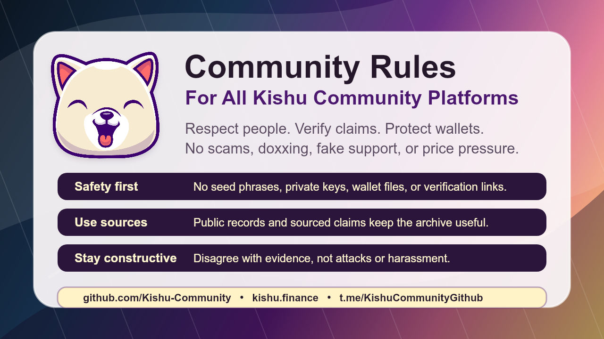

# Kishu Community Rules

This document is the current source of truth for rules across Kishu Community-managed spaces, including GitHub, Reddit, Telegram, Facebook, Instagram, Bluesky, Threads, X, and other community surfaces.

Platform-specific terms and moderation tools still apply. These rules are meant to keep community spaces safer, easier to moderate, and useful as a public archive.

## 1. **Follow Platform Rules**

Every post and comment must follow the rules of the platform it is posted on.

## 2. **Be Respectful**

No harassment, hate speech, threats, insults, witch hunts, or targeted abuse.

Disagree with claims and evidence, not with people.

## 3. **Safety First**

Never share or request:

- Seed phrases
- Private keys
- Recovery phrases
- Wallet files
- Remote desktop access
- Wallet verification links
- Migration, refund, recovery, or airdrop links

## 4. **No Financial Advice or Price Pressure**

Discussion is allowed.

Do not pressure people to buy, sell, hold, bridge, migrate, or connect a wallet.

No guaranteed profit, recovery, or price claims.

## 5. **No Doxxing or Private Personal Information**

Do not post private names, home addresses, phone numbers, private emails, employer details, family information, or identity claims.

Public contract addresses, transaction links, project accounts, and source references are allowed when relevant and sourced.

## 6. **No Scams, Impersonation, or Fake Support**

Do not impersonate the project, moderators, former team members, support accounts, or recovery agents.

Fake links and fake support offers will be removed.

## 7. **No Spam, Self-Promotion, or Unapproved Shilling**

No unrelated token, NFT, server, referral, paid service, or advertisement spam.

Kishu-related historical/social links are allowed when relevant and clearly disclosed.

Moderator approval may be required for promotional posts.

## 8. **Source Serious Claims**

Use public sources for factual claims, especially contract, wallet, ownership, deployment, and project-history claims.

Label speculation clearly.

Unsupported accusations may be removed.

## 9. **No NSFW or Graphic Content**

No NSFW, obscene, sexually explicit, or graphic violent content.

## 10. **English Only for Moderation Clarity**

Use English so moderators can review posts and comments consistently.

## Current References

- Kishu Community GitHub: https://github.com/Kishu-Community
- Current homepage: https://kishu.finance
- Community Telegram: https://t.me/KishuCommunityGithub
- Original KISHU Ethereum contract: `0xa2b4c0af19cc16a6cfacce81f192b024d625817d`

This rules document does not announce any migration, refund, recovery claim, wallet verification process, airdrop, or investment recommendation.

