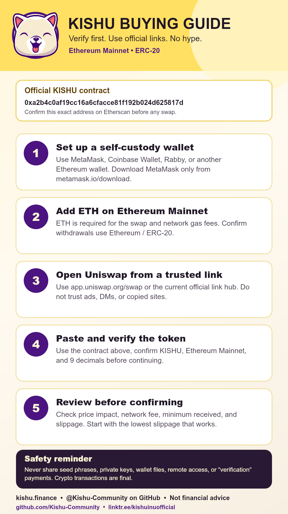

# KISHU Buying & Safety Guide 2026

Last updated: 2026-05-10

This is a current, safety-first guide for people who choose to verify or buy Kishu Inu (`KISHU`) on Ethereum. It is not financial advice, and it is not a promise about price, profit, recovery, migration, or future utility.

## Current References

- Current homepage: https://kishu.finance
- Official link hub: https://linktr.ee/kishuinuofficial
- Community archive/rebuild GitHub: https://github.com/Kishu-Community
- Community Telegram: https://t.me/KishuCommunityGithub
- Ethereum token contract: https://etherscan.io/token/0xa2b4c0af19cc16a6cfacce81f192b024d625817d
- Contract address: `0xa2b4c0af19cc16a6cfacce81f192b024d625817d`
- Network: Ethereum Mainnet
- Token standard: ERC-20
- Decimals: 9

Always verify the token contract on Etherscan before connecting a wallet or approving a swap. Do not trust ads, DMs, copied websites, fake support accounts, random "airdrop" links, or wallet verification messages.

## Why The GitHub Matters

The Kishu-Community GitHub is being used as an independent public archive/rebuild workspace for recovered materials, contract notes, wallet research, deployment notes, and project-status documentation.

It is not an official continuation of the original Kishu Inu project unless original contract, wallet, account, and deployment authority is publicly transferred or delegated.

Treat any migration, refund, recovery claim, wallet verification, or airdrop as suspicious unless it is documented in the Kishu-Community GitHub organization and verifiable from public sources.

## Before You Start

You need:

- A self-custody wallet such as MetaMask, Coinbase Wallet, Rabby, or another Ethereum-compatible wallet.
- ETH on Ethereum Mainnet for the swap and network gas fees.
- The correct KISHU contract address from Etherscan.
- A clear understanding that crypto swaps are final once confirmed on-chain.

Never share your seed phrase, private key, recovery phrase, wallet file, screen, remote desktop access, or any payment to "verify" a wallet. No legitimate admin or support account needs those.

## Step 1: Set Up A Wallet

If using MetaMask, download it only from the official MetaMask site:

https://metamask.io/download

Create or import your wallet, then store the Secret Recovery Phrase offline. Do not store it in screenshots, cloud notes, email drafts, Discord, Telegram, or browser bookmarks.

## Step 2: Add ETH On Ethereum Mainnet

You need ETH on Ethereum Mainnet to pay network fees. You can buy ETH through a wallet-supported provider or transfer ETH from a centralized exchange or another wallet.

When withdrawing ETH from an exchange, confirm that the withdrawal network is Ethereum Mainnet / ERC-20. Sending funds to the wrong network may make them difficult or impossible to recover.

## Step 3: Open A Trusted Swap Page

Use the current official link hub or go directly to Uniswap:

https://app.uniswap.org/swap

If you use Uniswap directly, paste the KISHU contract address manually and verify it before continuing:

`0xa2b4c0af19cc16a6cfacce81f192b024d625817d`

## Step 4: Review The Swap

Before confirming:

- Confirm the network is Ethereum Mainnet.
- Confirm the token is Kishu Inu (`KISHU`).
- Confirm the contract address matches Etherscan exactly.
- Review the quoted rate, price impact, network fee, and minimum received.
- Keep enough ETH in the wallet for gas.

KISHU has a transfer reward mechanism, so a swap may require custom slippage. Start with the lowest slippage that works. Increasing slippage can make execution worse, so do not raise it blindly.

## Step 5: Confirm And Verify

If everything looks correct, confirm the swap in your wallet. After confirmation, you can verify the transaction on Etherscan and add the token to your wallet using the same verified contract address.

If the token does not display automatically, add it as a custom token:

- Network: Ethereum Mainnet
- Contract: `0xa2b4c0af19cc16a6cfacce81f192b024d625817d`
- Symbol: `KISHU`
- Decimals: `9`

## Common Safety Checks

- Bookmark official links instead of searching every time.
- Watch for fake Uniswap, fake MetaMask, fake KISHU, and fake support links.
- Ignore anyone asking you to "verify" your wallet by entering a seed phrase.
- Do not sign messages or approvals you do not understand.
- Revoke unused token approvals periodically using a trusted approval checker.
- Test with a small amount first if you are unfamiliar with a wallet or DEX.

## Closing Note

This guide is here to help people verify the correct contract and avoid old misinformation. No one should feel pressured to buy, hold, sell, or take risk because of a social media post.

DYOR. Use official links. Verify before every wallet interaction.
