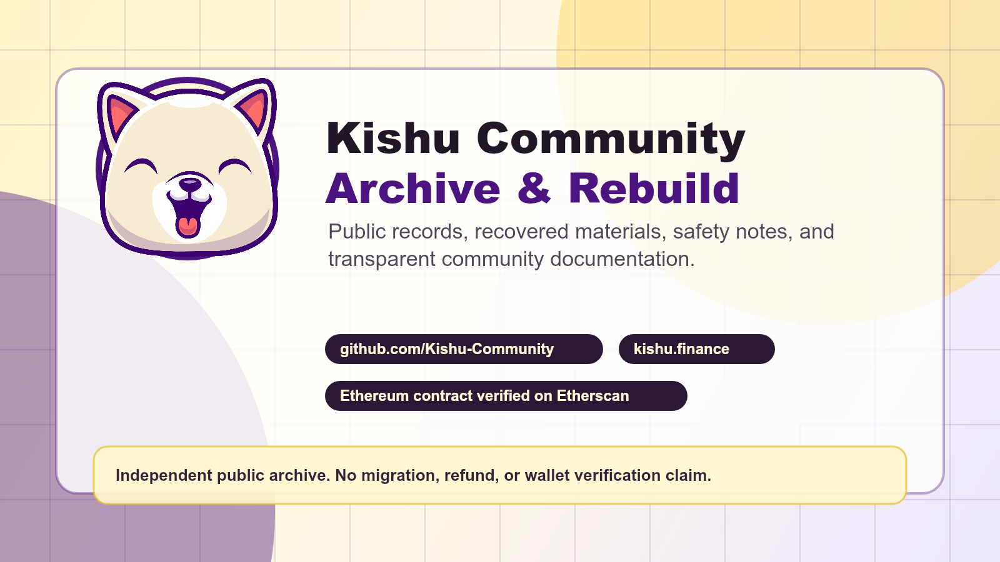

# What’s Happening With the Kishu Community Archive and Rebuild

Suggested subtitle: A public update on the new GitHub organization, recovered materials, safety notes, and why transparent records matter for KISHU holders and the wider community.

Suggested tags: `Kishu Inu`, `Crypto Safety`, `Ethereum`, `Open Source`, `Community`

Kishu Inu has been around long enough that the public record is scattered across websites, social accounts, contracts, NFT collections, repositories, archived files, and old community posts. Some of those links still work. Some do not. Some claims from the old project era are hard to verify today without digging through public records.

That is the reason for the current Kishu Community archive and rebuild effort.

This is not a hype post, a price post, a migration announcement, or a claim that everything from the past can be fixed. It is a practical update about what is being organized now, where people can check information, and what this community effort can and cannot safely do.

## The New Public Hub

The main public workspace is the Kishu-Community GitHub organization:

https://github.com/Kishu-Community

The current rebuild homepage is:

https://kishu.finance

The current community Telegram for this GitHub/archive effort is:

https://t.me/KishuCommunityGithub

GitHub matters because it gives the community a place where public notes, recovered files, deployment references, guides, and status updates can be reviewed without relying only on social platforms. Posts on Reddit, Telegram, X, Medium, or other platforms can be deleted, buried, locked, or separated from context. A GitHub repository gives the community a more durable place to inspect changes over time.

One example is the new social media post archive:

https://github.com/Kishu-Community/social-media-posts

That repository is being used to keep longer versions of posts, images, safety references, and public-facing updates in one place.

## The Most Important Safety Point

The original KISHU token contract is:

`0xa2b4c0af19cc16a6cfacce81f192b024d625817d`

Etherscan reference:

https://etherscan.io/token/0xa2b4c0af19cc16a6cfacce81f192b024d625817d

This community archive/rebuild effort does not control the original KISHU token contract, legacy deployer wallets, owner Safe, NFT collection owner wallets, or former team accounts.

That matters because there are limits to what can be changed safely. Without verified authority over the original contracts and wallets, this effort cannot:

- Change the original KISHU token contract.
- Control the original owner Safe.
- Move, repair, or upgrade legacy staking contracts.
- Force a migration.
- Update old NFT contracts or collection ownership.
- Claim to be the official continuation of the original project.
- Promise that historical losses will be recovered or made whole.

Any message claiming there is an active migration, refund, recovery claim, wallet verification, or airdrop should be treated as suspicious unless it is documented in the Kishu-Community GitHub organization and verifiable from public sources.

This community effort will never ask for a seed phrase, private key, recovery phrase, wallet file, remote desktop session, or payment to "verify" a wallet.

## What Has Been Organized So Far

The current work is focused on public records and transparent rebuilding.

That includes:

- Preserving recovered public materials.
- Publishing safety-first buying and contract reference guides.
- Keeping current links visible.
- Mapping known websites, repositories, contracts, deployments, wallets, and NFT collections where public information is available.
- Separating historical claims from current, verifiable systems.
- Marking older ecosystem items as historical, abandoned, incomplete, or unverified unless there is current evidence that they are maintained.

The goal is not to rewrite the past. The goal is to preserve the record and make it easier for the community to tell the difference between:

- What exists today.
- What was promised historically.
- What was actually deployed.
- What is broken or missing.
- What would need to be rebuilt correctly.

## Why This Needs To Be Public

Crypto communities are vulnerable when important information only exists in private chats, old social posts, or accounts controlled by people who may no longer be active.

Public documentation helps reduce confusion. It also makes it harder for anyone to invent a fake "official" recovery, fake migration, fake support process, or fake wallet verification flow.

A GitHub-based archive does not solve every problem, but it does create a public trail. People can see when files were added, what changed, and which repositories are connected to the current community rebuild.

That is especially useful for older projects where many links, accounts, and claims have changed over time.

## What This Is Not

This is not a token launch.

This is not an investment recommendation.

This is not a promise of price movement, profit, recovery, refunds, or future utility.

This is not a request for wallet access.

This is not a request for private information.

This is also not an accusation page. The current focus is on public-source documentation, recovered materials, and community safety. If something cannot be verified from public records, it should be labeled carefully instead of treated as fact.

## How Community Members Can Use The GitHub

If you want to understand what is current, start here:

https://github.com/Kishu-Community

For public posts and longer versions of community updates:

https://github.com/Kishu-Community/social-media-posts

For the current homepage:

https://kishu.finance

For the current community Telegram:

https://t.me/KishuCommunityGithub

If you are reviewing any KISHU-related link, compare it against those references before connecting a wallet or trusting a claim.

## What Comes Next

The next phase is documentation and cleanup:

- Continue organizing recovered public materials.
- Keep current safety guides updated.
- Label old ecosystem items clearly.
- Document known contracts, wallets, frontends, and deployment references where public evidence exists.
- Keep rebuild work transparent.
- Avoid private deals, hidden teams, or vague promises.

The standard should be simple: if a claim cannot be verified publicly, it should not be presented as certainty.

## Closing

Kishu Inu has a long public history. Some of it is still visible, some of it is fragmented, and some of it needs careful review. The archive/rebuild effort is an attempt to make that process visible instead of asking the community to trust private explanations.

Trust should be earned in public.

Use official links. Verify contracts. Do not share wallet secrets. Treat recovery or migration claims with caution unless they are documented and verifiable.

Disclosure: This article was drafted with AI assistance and reviewed for a safety-first, non-promotional community update. It is not financial, investment, tax, or legal advice.
